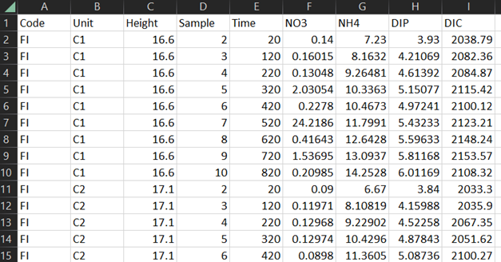

 

Welcome to **Flux Evaluation in R** (FLUXER)! This app allows you to
easily calculate sediment-water fluxes of dissolved compounds using
linear regression, with the help of robust quality checks of your data.

The app was written by Astrid Hylén (University of Antwerp, Belgium) and
Sebastiaan van de Velde (National Institute of Water and Atmospheric
Research & University of Otago, New Zealand).

 

<h3>
Instructions
</h3>

##### *Prepare the data file*

Make sure your data is in the correct format in an Excel file. The data
file should contain the following columns:

-   **Code** – the ID or name of the station/treatment.  
-   **Unit** – the ID of the individual incubation unit (e.g., R3 for
    “replicate 3”).  
-   **Height** – the height of the overlying water in the incubation
    (cm).  
-   **Sample** – the ID of the individual sample within an incubation
    (e.g., numbers 1-5 for an incubation with 5 sampling points).  
-   **Time** – the time since the start of the incubation (minutes).  
-   **Parameter columns** – individual columns for all measured
    parameters, with the parameter names as the headers and the
    concentrations in mol m-3 (see image below). The concentrations should be
    corrected for any dilutions that have occurred during sampling.

  

Note that the text in the Code, Unit and Sample columns cannot contain
spaces or special characters!

##### *Calculate fluxes*

1.  Go to the *Flux evaluation* tab in the top right corner.
2.  Upload a raw data file by clicking the *Browse* button on the
    left-hand side and locate your file. Fluxes (mmol m-2 d-1) are
    automatically calculated for all units based on linear fits and
    using all data points.
3.  Navigate between the different incubation units through the
    drop-down menu under *Select data*.
4.  The regression model from which the flux is calculated can be
    modified:
    -   use *Select fit* to change between linear and quadratic
        regression lines
    -   click on data points in the main graph (Concentration vs Time)
        to remove them from the regression model, and click them again
        to reintroduce them
    -   to save any changes made to the regression model, click *Save
        model*
5.  To save the results of the flux calculations, click *Save output
    file*. You can save the results at any point and continue the
    evaluation afterward.

##### *Output file*

The output file contains two sheets, ***UnitResults*** and
***SampleResults***.

***UnitResults***:

-   **Code, Unit** – same as input file  
-   **Parameter** – parameter name  
-   **Flux** – calculated flux (mmol m-2 d-1), where positive values are
    fluxes out of the sediment and negative values are fluxes into the
    sediment  
-   **Fvalue** – F statistic  
-   **pF** – p value of the F statistic  
-   **FitcAIC** – corrected Akaike’s information criterion  
-   **Fit** – type of regression line (linear or quadratic)  
-   **AdjR2** – adjusted R2 value  
-   **A, B, C** – coefficients for the regression equation, where Conc =
    A + B ∙ Time + C ∙ Time2  
-   **pA, pB, pC** – p values for the coefficients  
-   **StdErrA, StdErrB, StdErrC** – standard error for the coefficients

***SampleResults***:

-   **Code, Unit, Height, Sample, Time** – same as input file  
-   **Parameter** – parameter name  
-   **Conc** – measured concentration (uM), the same values as in the
    input file  
-   **Removed** – whether the point was removed during the evaluation
    (TRUE) or not (FALSE)  
-   **FitValue** – fitted value  
-   **Residual** – residual  
-   **R.stan** – standardized residual  
-   **Theor.quant** – theoretical quantile  
-   **Root.r.stan** – square root of standardized residuals  
-   **R.stud** – studentized residual  
-   **Leverage** – hat value  
-   **Cooks** – Cook’s distance

 

<h3>
Theoretical background
</h3>

In benthic chamber incubations, a known volume (*V*; m-3) of
bottom water overlying a known sediment area (*A*; m-2) is
incubated. The change of solute concentration (*C*; mmol) with time
(*t*; d) is measured and the flux (*J*; mmol m-2
d-1) is then calculated as:

$$J = \frac{\frac{dC}{dt}V}{A}$$

Since the volume divided by the area equals the hight of water in the
chamber (*H*; m), the flux incubation can be simplified as:

$$J = \frac{dC}{dt}H$$

To find the value of *dC/dt*, a regression model is fit to the data of
concentration versus time.

The sediment-water flux is generally expected to be constant over the
timespan of a flux incubations, enabling the use of simple linear
regressions. However, fluxes that do not follow a simple linear
regression are occasionally observed (Devol et al., 1997; Forja and
Gomez-Parra, 1998; Nilsson et al., 2019). Curvatures in the data can
occur for a number of reasons, for example changed redox conditions due
to oxygen depletion in the chamber (Severmann et al., 2010; Kononets et
al., 2021). A common explanation for curvature in data, though, is
saturation effects (Devol et al., 1997; Forja and Gomez-Parra, 1998). As
a solute is taken up by or released from the sediment, the concentration
gradient between sediment and water in the chamber will decrease. In
some cases, the alteration of the gradient is large enough to reduce the
flux during the incubation. In those cases, data should follow an
exponential function and eventually reach an asymptotic value. Problems
with curvature in flux data due to saturation effects have sometimes
been solved using nonlinear equations (e.g., Forja and Gomez-Parra,
1998). However, case where the saturation effects have been strong
enough to cause plateauing of the data are rare, and quadratic
regressions generally give good enough fits to reliably calculate fluxes
for these type of data.

For a simple linear regression, *dC/dt* is constant and the flux is
calculated by multiplying this value with *H*. When the regression
follows a quadratic line, however, *dC/dt* varies with time. Here, the
flux is calculated only for the initial timepoint. This ensures that
potential effects of saturation or redox changes (e.g. due to oxygen
depletion) are excluded. The regression line is not extrapolate to time
= 0, as quadratic models should not be used outside of the range of the
measured values. To evaluate whether a linear or quadratic regression
model fits the data better, the corrected Akaike information criterion
(cAIC; Hurvich and Tsai, 1989) is used. The cAIC is a model selection
method that balances a likelihood function with a penalty that increases
with the number of dependent variables. Out of a set of compared models,
the one with the lowest cAIC value is the relatively most parsimonious,
i.e. has the best fit with the fewest dependent variables. It has been
suggested that the cAIC values should differ by &gt;2 for the model with
the lower value to be seen as a substantially better fit (Burnham and
Anderson, 2002).

To ensure a good model fit and to investigate whether the assumptions
for linear regression (Montgomery et al., 2012) are fulfilled, five
diagnostic graphs are used:

-   **Residuals versus fitted values**. This graph gives information
    about linearity and, to some extent, homoscedasticity. If the
    assumption of linearity is fulfilled, the points should be randomly
    scattered in the graph. Points following a pattern indicate problems
    with the fit. If the assumption about homoscedasticity is fulfilled,
    the points should be evenly scattered around a residual value of
    0.  
-   **Scale-location plot**. The square root of standardized residuals
    versus fitted values. This graph gives information about
    homoscedasticity. The points should be evenly and randomly spread
    around a horizontal line.  
-   **Residuals versus time**. A pattern in this graph indicates that
    errors are not random, i.e. not independent of time or sample
    order.  
-   **Normal Q-Q (quantile-quantile) plot**. This graph is used to
    validate the assumption about normally distributed errors. This
    assumption is acceptable if the points follow a straight, diagonal
    line.
-   **Influence plot**. The graph displays three different indicators:
    studentized deleted residuals (SDR), hat values, and Cook’s distance
    (Di). This graph helps to identify points that have a
    high influence on the model, i.e., the addition or removal of that
    point changes the model fit drastically. The SDR indicates if a
    point is an outlier, a point that does not follow the same trend for
    the dependent variable as the other points. An SDR with a value
    higher than 3 (dotted lines) can be considered to be an outlier
    (Montgomery et al., 2012). The hat value identifies leverage points,
    data with extreme values for the independent variable compared to
    the rest. Points with hat values higher than 3\*p/n (dashed line),
    where p is the number of parameters in the model and n is the sample
    size, can be considered to be leverage points (Hair et al., 2013b).
    Di is a measure of how strongly single observations
    influence the estimated model parameters. It depends on both the
    magnitude of the residual and leverage. Points with a Di
    value higher than 4/(n-k-1) (Hair et al., 2013a), where n is the
    sample size and k is the number of independent variables. The
    Di value is the one of these three indicators that most
    clearly shows how strong the influence from a certain point is on
    the slope of the regression line, still information about the SDR
    and hat values is important. Outliers and leverage points may have
    strong effects on model summary statistics, e.g. the R2
    value or standard error. Even if removal of these points is not
    motivated, knowing how they affect the model is valuable.

 

##### *References*

Burnham K. P. and Anderson D. R. (2002) Model Selection and Inference: A
Practical Information-Theoretic Approach., Springer-Verlag, New York.

Devol A. H., Codispoti L. A. and Christensen J. P. (1997) Summer and
winter denitrification rates in western Arctic shelf sediments.
Continental Shelf Research 17, 1029–1050.

Forja J. M. and Gomez-Parra A. (1998) Measuring nutrient fluxes across
the sediment-water interface using benthic chambers. Marine Ecology
Progress Series 164, 95–105.

Hair J. F., Black W. C., Babin B. J. and Anderson R. E. (2013a) Advanced
Diagnostics for Multiple Regression: A Supplement to Multivariate Data
Analysis.

Hair J. F., Black W. C., Babin B. J. and Anderson R. E. (2013b)
Multivariate data analysis, Pearson New International Edition. 7th ed.,
Pearson Higher Ed USA.

Hurvich C. M. and Tsai C.-L. (1989) Regression and Time Series Model
Selection in Small Samples. Biometrika 76, 297–307.

Kononets M. Y., Tengberg A., Nilsson M. M., Ekeroth N., Hylén A., van de
Velde S. J., Rütting T., Bonaglia S., Blomqvist S. and Hall P. O. J.
(2021) In situ incubations with Gothenburg benthic chamber landers:
Applications and quality control. Journal of Marine Systems 214, 1–20.

Montgomery D. C., Peck E. A. and Vining G. G. (2012) Introduction to
linear regression analysis. 5.th ed., Wiley.

Nilsson M. M., Kononets M. Y., Ekeroth N., Viktorsson L., Hylén A.,
Sommer S., Pfannkuche O., Almroth-Rosell E., Atamanchuk D., Andersson H.
J., Roos P., Tengberg A. and Hall P. O. J. (2019) Organic carbon
recycling in Baltic Sea sediments – An integrated estimate on the system
scale based on in situ measurements. Marine Chemistry 209, 81–93.

Severmann S., McManus J., Berelson W. M. and Hammond D. E. (2010) The
continental shelf benthic iron flux and its isotope composition.
Geochimica et Cosmochimica Acta 74, 3984–4004.

 
